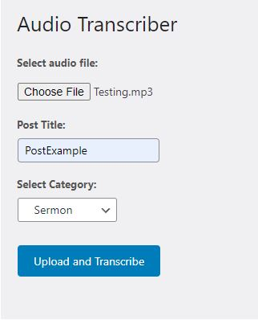
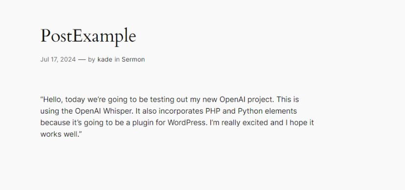
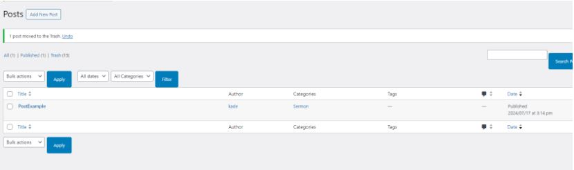

# audio-transcriber

Transcribes audio files to a WordPress post.
Configuration guide: in order for this WordPress plugin to work you must provide a valid API key in the audio transcriber.php file. This can be done on line 83, after you have entered 
a valid API key you can then make a compressed zip containing these three files. You will be able to install this plugin directly into your WordPress plugins and it will be ready to go. 

Demo: You will be prompted with 3 input fields.

After you upload and transcribe you will be provided with a link to review your post. This link will redirect you to your new post.

You could also manually navigate to it by opening your post section in your admin dashboard.

